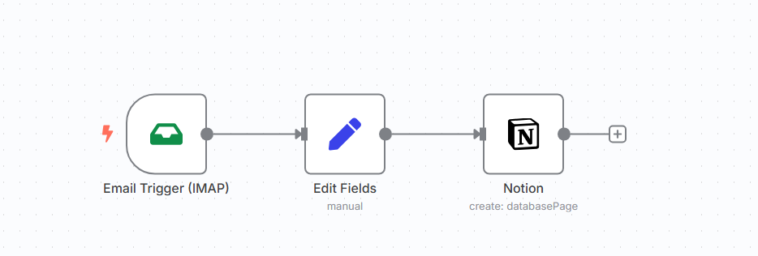
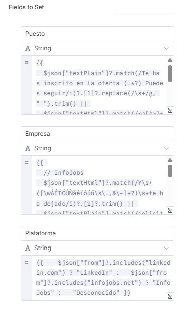

# Automation of Job Application Registrations with n8n

This project automates the extraction and registration of job application submissions received by email from platforms like InfoJobs and LinkedIn, storing the information in a Notion database. The workflow is managed with **n8n** and deployed using **Docker Compose**.

---

## 📦 Contents

- n8n workflow that captures unread emails from InfoJobs and LinkedIn.  
- Automatic extraction of key data: position, company, and platform.  
- Automatic registration in Notion database.  
- Deployment with Docker Compose for local or server execution.  


---

## ⚙️ Requirements

- Docker and Docker Compose installed.  
- Notion account with database prepared and shared with the n8n integration.  
- IMAP credentials for the email receiving the job application notifications.  
- `.env` file with sensitive variables (user, password, timezone).

---

## 🚀 Deployment

1. Clone the repository.

2. Create a `.env` file with the following content:

   ```env
   TZ=Europe/Madrid
   N8N_BASIC_AUTH_ACTIVE=true
   N8N_BASIC_AUTH_USER=your_username
   N8N_BASIC_AUTH_PASSWORD=your_secure_password

3. Run the container with Docker Compose:

4. Access n8n at `http://localhost:5678` and configure your IMAP and Notion credentials.

5. Activate the workflow to start it running automatically.

---
⚠️ **Note:** This workflow relies on keyword-based extraction and may not work correctly for emails in other languages or from different platforms. Adaptations might be necessary to support additional languages or sources.



## 🛡 Security

- Do not include credentials in the repository.  
- Use the `.env` file and ensure it is included in `.gitignore`.  
- Set a strong password for n8n basic authentication.

---

## 📄 Usage

- The workflow checks new emails from InfoJobs and LinkedIn.  
- Extracts relevant data (position, company, platform).  
- Automatically adds a record to the Notion database.  
- You can modify the workflow to adapt platforms or data.

---

## 🤝 Contributions

Contributions, suggestions, and improvements are welcome. Feel free to open issues or pull requests.

# Automatización de Inscripciones a Ofertas de Trabajo con n8n

Este proyecto automatiza la extracción y registro de inscripciones a ofertas de trabajo recibidas por correo electrónico desde plataformas como InfoJobs y LinkedIn, almacenando la información en una base de datos Notion. El flujo está gestionado con **n8n** y desplegado mediante **Docker Compose**.

---

## 📦 Contenido

- Flujo n8n que captura correos no leídos de InfoJobs y LinkedIn.  
- Extracción automática de datos clave: puesto, empresa y plataforma.  
- Registro automático en base de datos Notion.  
- Despliegue con Docker Compose para ejecución local o en servidor.


---

## ⚙️ Requisitos

- Docker y Docker Compose instalados.  
- Cuenta de Notion con base de datos preparada y compartida con la integración de n8n.  
- Credenciales IMAP para el correo donde llegan las notificaciones de ofertas.  
- Archivo `.env` con variables sensibles (usuario, contraseña, zona horaria).

---

## 🚀 Despliegue

1. Clona el repositorio.

2. Crea un archivo `.env` con el siguiente contenido:

   ```env
   TZ=Europe/Madrid
   N8N_BASIC_AUTH_ACTIVE=true
   N8N_BASIC_AUTH_USER=tu_usuario
   N8N_BASIC_AUTH_PASSWORD=tu_contraseña_segura

3. Ejecuta el contenedor con Docker Compose:

4. Accede a n8n en `http://localhost:5678` y configura tus credenciales IMAP y Notion.

5. Activa el flujo para que comience a funcionar automáticamente.

---
⚠️ **Note:** Este flujo de trabajo se basa en la extracción de palabras clave y podría no funcionar correctamente con correos electrónicos en otros idiomas o plataformas. Podrían ser necesarias adaptaciones para admitir otros idiomas o fuentes.


## 🛡 Seguridad

- No incluyas credenciales en el repositorio.  
- Usa el archivo `.env` y asegúrate de incluirlo en `.gitignore`.  
- Configura una contraseña segura para el acceso básico de n8n.

---

## 📄 Uso

- El flujo revisa los correos nuevos de InfoJobs y LinkedIn.  
- Extrae los datos relevantes (puesto, empresa, plataforma).  
- Añade un registro en la base de datos de Notion automáticamente.  
- Puedes modificar el flujo para adaptar plataformas o datos.

---

## 🤝 Contribuciones

Contribuciones, sugerencias y mejoras son bienvenidas. Puedes abrir issues o pull requests.